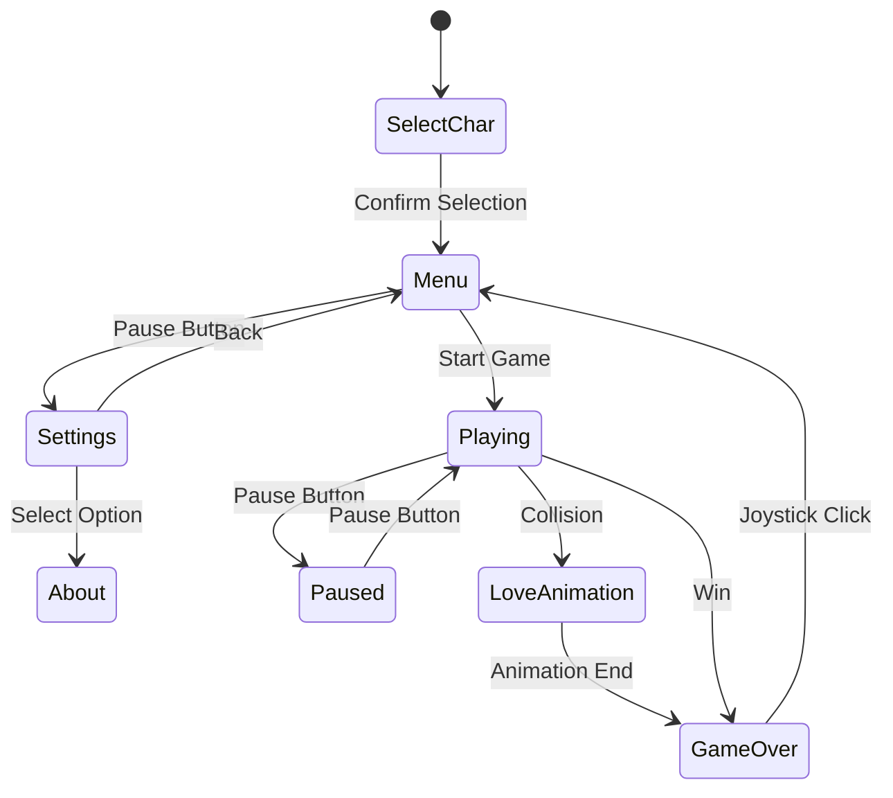
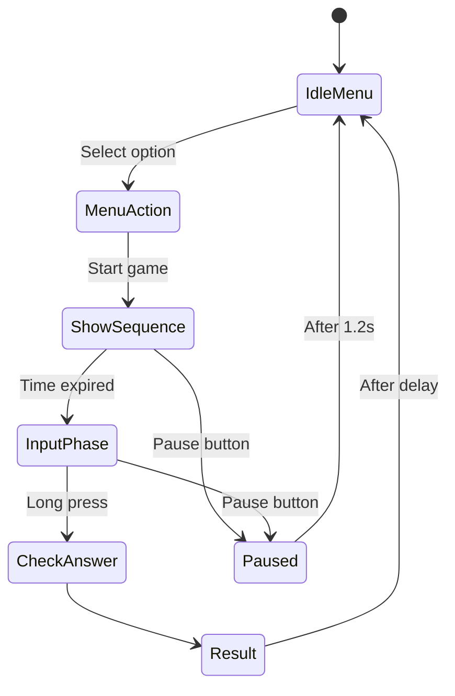

# Introduction to Robotics (2025-2026)

## Laboratory Homeworks

Faculty of Mathematics and Computer Science, University of Bucharest
3rd Year – Robotics Specialization

This repository contains the laboratory homeworks completed for the Introduction to Robotics course.
Each homework includes the official requirements, source files, implementation details, images of the physical setup, and a demonstration video.

 

## Homework 5 - LCD Platformer: Dangerous Love

### Task Requirements

Design and implement a side-scrolling platformer game on a 16x2 LCD display using **Clean Architecture** principles (Separation of Concerns). The system must utilize a **GameModel** for logic, a **GameController** for inputs/updates, and an **IRenderer** interface to decouple drawing logic from game state.

The game features character selection, procedural map generation, jumping physics, score persistence (EEPROM), and a menu system.

### Implementation Details

* **Procedural Generation:** The `generateMap()` function creates a new 100-tile world each round. It uses `random()` to place enemies (1) and hearts (2), ensuring the first 5 tiles are always safe for spawning.
* **Floating Point Physics:** The player's X position is stored as a `float` (incremented by 0.5). This allows for smoother internal logic calculation, which is then cast to `int` for grid rendering.
* **Camera Logic:** The camera window (16 chars) does not lock strictly to the player. It uses a "dead zone" approach: the camera only scrolls forward if the player moves past the 8th column relative to the screen, and scrolls back if the player retreats too close to the left edge.
* **Smart Rendering:** The `drawGame` function iterates only through the 16 columns currently visible based on `cameraX`. It calculates the offset into the global `mapData` matrix, ensuring efficiency.
* **Non-Blocking Audio:** All sounds are handled via `millis()`. The `playSound()` function sets a timestamp, and the main loop checks if the duration has elapsed to call `noTone()`, ensuring gameplay never freezes for sound.
  
### Implemented Bonuses

For this project I have implemented multiple bonus features as described in the requirements (Sections 5.4.5 and 5.6):

* **Clean Architecture & Dual Rendering (Section 5.6 Bonus):**
    * Implemented a flexible **IRenderer interface**.
    * Created two concrete renderers: `LCDRenderer` (for gameplay) and `SerialRenderer` (for debugging and game logic verification via Serial Monitor without a display). This strictly enforces the Separation of Concerns principle.

* **Menu Complexity & About Section:**
    * Implemented a nested **Settings Menu** accessible via the Pause button.
    * Added an **About Section** displaying the creator's name and game info.
    * The Main Menu is dynamic, cycling through 3 different titles (`~Dangerous Love~`, `~Run Run RUN!~`, `~Hearts Thief~`) to keep the UI active.

* **Reset Highscore Option:**
    * Included a functional "Reset Score" option within the Settings menu that clears the EEPROM memory (sets top scores to 0).

* **Animations and Sound:**
    * **Love Animation:** A dedicated cutscene when the player collides with the enemy (hearts appear, game pauses).
    * **Audio Feedback:** Distinct sounds for Menu Navigation (Tick), Selection (Confirm), Jumping, and Collecting items.
    * **Musical Sequence:** A rising scale melody plays during the "Love Animation" sequence.
    * **Slide Transitions:** The Game Over screen is not static; it automatically cycles through slides (Message -> Score -> Instructions).

* **Extra Logic & Game Complexity:**
    * **Character Selection:** Added a pre-game state where the player selects their avatar (Boy or Girl). This logic fundamentally changes the sprites: the unselected character becomes the in-game enemy.
    * **Camera Physics:** Implemented a "soft follow" camera that tracks the player smoothly (updates when player moves >8 tiles right or <2 tiles left) rather than jarring screen-flips.

* **Creative Theme:**
    * Instead of a standard "Death", the game over state is thematically integrated as "Falling in love" (colliding with the partner), turning a hazard into a narrative element.
      
### Components

| Component | Quantity | Description |
| :--- | :--- | :--- |
| Arduino Uno | 1 | Microcontroller |
| 16x2 LCD (HD44780) | 1 | Main display |
| Joystick Module | 1 | X/Y Analog + Switch |
| Push Button | 1 | Pause/Back function |
| Passive Buzzer | 1 | Audio feedback |
| Resistors | As needed | LCD contrast and current limiting |

### Pin Map

| Function | Arduino Pin | Notes |
| :--- | :--- | :--- |
| LCD RS | 8 | Register Select |
| LCD EN | 9 | Enable |
| LCD D4 | 4 | Data Pin 4 |
| LCD D5 | 5 | Data Pin 5 |
| LCD D6 | 6 | Data Pin 6 |
| LCD D7 | 7 | Data Pin 7 |
| Joystick X | A0 | Horizontal movement |
| Joystick Y | A1 | Vertical movement (Menu) / Jump |
| Joystick SW | 2 | Select / Start / Restart (Active LOW) |
| Pause Button | 10 | Active LOW (Internal Pull-up) |
| Buzzer | 3 | PWM Audio output |
| Random Seed | A5 | Unconnected pin for entropy |

### System Behavior Summary

Upon booting, the game enters the **Character Selection** state (`< GIRL >` vs `< BOY >`). The choice determines the player sprite and the enemy sprite.

In the **Idle/Menu** state, the display cycles through the top 3 high scores from EEPROM and the dynamic game titles.
During the **Gameplay**, the player navigates a procedurally generated map (100 tiles). The camera implements a "soft follow" mechanic, scrolling the world when the character moves past the center.

* **Objective:** Reach the finish line (Tile 100) while collecting Hearts.
* **Hazards:** Colliding with the "partner" (enemy) triggers the **Love Animation** (a rising tone sequence + visual hearts), resulting in Game Over.

The **Physics Engine** handles gravity. A jump moves the player to the top row for ~1.5 seconds before gravity pulls them back.

The **Settings Menu** allows the user to reset stored scores or view credits. The **Pause** button can be used to pause the game or as a "Back" button in menus.

### Controls

| Action | Input | Description |
| :--- | :--- | :--- |
| Move Left/Right | Joystick LEFT / RIGHT | Moves character horizontally |
| Jump | Joystick UP | Jumps to the top row (gravity applied) |
| Menu Navigate | Joystick UP / DOWN | Select settings options |
| Confirm / Start | Joystick Button (SW) | Confirm selection / Start Game |
| Pause Game | Button (Pin 10) | Toggles Pause state |
| Back | Button (Pin 10) | Return from Settings/About to Menu |
| Reset Score | Joystick Button (SW) | Inside Settings -> Reset option |

### Display Texts & UI

* **Menu:** Cycles Highscores (`1st`, `2nd`, `3rd`) and Titles.
* **Pause:** `!! PAUSED !!` / `Press to Resume`.
* **Win Screen:** `Level Completed!` / `No toxic love`.
* **Lose Screen:** `Game over! :(` / `You fell in love`.
* **Settings:** `> Reset Score` / `> About Section`.

### Buzzer Feedback

The audio system uses non-blocking logic (`millis()`).

| Event | Sound | Description |
| :--- | :--- | :--- |
| Menu Select | 1000 Hz (200ms) | Confirmation beep |
| Jump | 600 Hz (100ms) | Upward movement sound |
| Collect Heart | 2000 Hz (50ms) | High-pitch "coin" sound |
| Pause | 500 Hz / 1000 Hz | Toggle sounds |
| Settings Enter | 800 Hz (100ms) | Navigation sound |
| **Love Animation** | Rising Scale | 523Hz -> 659Hz -> 784Hz -> 1046Hz sequence |

### Custom Characters (Bitmaps)

The game uses custom 5x8 bitmaps to render the entities.

| Character | Binary Pattern (Concept) | Description |
| :--- | :--- | :--- |
| **Girl** | `0b10001, 0b01110...` | Player or Enemy depending on selection |
| **Boy** | `0b01110, 0b01110...` | Player or Enemy depending on selection |
| **Heart** | `0b00000, 0b01010...` | Collectible item (`<3`) |

### Architecture & SoC

The code follows the **Model-View-Controller (MVC)** pattern:

1.  **GameModel:** Holds the state (player position `float x, y`, map data, score, state enums). It is completely decoupled from hardware.
2.  **IRenderer (Interface):** An abstract class defining methods like `drawGame`, `drawMenu`.
    * **LCDRenderer:** Concrete implementation for the 16x2 screen.
    * **SerialRenderer:** Implementation for debugging via Serial Monitor.
3.  **GameController:** Bridges Input and Model. Handles the game loop, timers (`millis`), physics calculations, and updates the view.

### State Diagram

The game logic flows through the following states:

### EEPROM Memory Map

The top 3 high scores are stored in the EEPROM. If the values are invalid (garbage data), they are initialized to 0.

| Address | Data | Description |
| :--- | :--- | :--- |
| 0x00 - 0x01 | `int` (2 bytes) | 1st Place Score |
| 0x02 - 0x03 | `int` (2 bytes) | 2nd Place Score |
| 0x04 - 0x05 | `int` (2 bytes) | 3rd Place Score |

### Difficulty & Timing

* **Update Rate:** Game logic ticks every **100ms**.
* **Jump Physics:** Duration 1500ms (Gravity simulation).
* **Map Size:** 100 tiles.
* **Slideshow:** Results screen slides update every 2000ms.

### Pictures of the Setup
......

### Video 
......
  
 

## Homework 4 - Simon Says

### Task Requirements

Design and implement a Simon Says memory game using a 4-digit 7-segment display driven by a 74HC595 shift register, a joystick for control, a buzzer for audio feedback, and an extra push button for the pause/menu function.

The game displays a sequence of 4 digits that the player must memorize and reproduce correctly using the joystick. Each round gets progressively faster.

### Components

- Component	Quantity	Description
- 74HC595 Shift Register	1	Drives the 7-segment segments
- 4-Digit 7-Segment Display	1	Common Anode display (documented below)
- Joystick with Push Button	1	X, Y, and SW used for input
- Buzzer	1	Non-blocking sound feedback
- Push Button	1	Pause/Menu function
- Resistors & Wiring	as needed	Segment current-limiting and pull-downs

### Pin Map

- Function	Arduino Pin	Notes
- 74HC595 LATCH	11	Controls output register
- 74HC595 CLOCK	10	Shifts bits
- 74HC595 DATA	12	Serial data in
- Digit Select Pins	4, 5, 6, 7	Control the 4 digits (multiplexed)
- Joystick X	A0	Horizontal movement
- Joystick Y	A1	Vertical movement
- Joystick SW	8	Push button (active LOW, internal pull-up)
- Pause/Menu Button	2	Active LOW (connected to GND)
- Buzzer	9	Non-blocking tone output

### System Behavior Summary

In the Idle/Menu state, the 4-digit display cycles between the options PLAy, SCOR, StOP, and HELP.
The player navigates using the joystick, and a short tick sound is heard every time the selection changes.

During the ShowSequence phase, a random 4-digit sequence is displayed on the screen for a limited time T milliseconds, which decreases with each successful round to increase difficulty.

In the InputPhase, the player re-enters the displayed digits using the joystick.
The currently active digit blinks fast (4 Hz), while locked digits blink slowly (1 Hz), giving clear visual feedback about the editing state.

In the CheckAnswer stage, the program compares the user’s input with the generated sequence.
If correct, a success tone is played and the score increases; otherwise, an error tone is emitted.

The Result state briefly displays either the updated score or Err on the display, before automatically returning to the main menu.

Finally, pressing the Pause/Menu button at any time during gameplay shows PAUS on the display.
After approximately 1.2 seconds, the game exits the paused state and returns safely to the main menu.

### Controls
Action	Input	Description
Move cursor	Joystick LEFT / RIGHT	Select active digit (0–3)
Edit digit	Joystick UP / DOWN	Change current digit value (0–9)
Lock/unlock	Short press (SW)	Lock/unlock current digit
Submit answer	Long press (SW)	Confirm all digits
Pause/Menu	Push button (pin 2)	Shows “PAUS” and returns to menu

### Display Texts (4-digit messages)
Menu – Play =	PLAy
Menu – Score =SCOR
Menu – Stop	= StOP
Menu – Help	= HELP (H custom character)
During pause = PAUS
Wrong answer = Err
Show score = Numeric value
Game idle	= Current menu item

### Buzzer Feedback
- Event	Sound
- Cursor move	Tick (short 2kHz beep)
- Lock/unlock digit	Click (1.5kHz, 80ms)
- Success	Success jingle (2.2kHz, 200ms)
- Error	Low tone (400Hz, 400ms)

All buzzer sounds are non-blocking using millis() control logic.

### Font Table (Segment Encoding)

| Character | Bitmask (ABCDEFG.) |
|------------|--------------------|
| 0 | `0b11111100` |
| 1 | `0b01100000` |
| 2 | `0b11011010` |
| 3 | `0b11110010` |
| 4 | `0b01100110` |
| 5 | `0b10110110` |
| 6 | `0b10111110` |
| 7 | `0b11100000` |
| 8 | `0b11111110` |
| 9 | `0b11110110` |
| A | `0b11101110` |
| C | `0b10011100` |
| E | `0b10011110` |
| L | `0b00011100` |
| O | `0b11111100` |
| P | `0b11001110` |
| R | `0b00001010` |
| S | `0b10110110` |
| t | `0b00011110` |
| U | `0b01111100` |
| y | `0b01110110` |
| H (custom) | `0b01101110` |
| Space | `0b00000000` |

Reasoning:
Characters chosen for best readability on 7-segment displays (e.g., “y” instead of “Y”, “t” lowercase for clarity).

### Timing and Difficulty
- Parameter	Default	Description
- Initial sequence display time	5000 ms	Time digits are visible
- Decrease per round	1500 ms	Faster difficulty scaling
- Minimum display time	800 ms	Fastest speed possible

Timing is handled entirely using millis() — no delay() calls are used anywhere.

### State Diagram

The state machine below illustrates the logical flow of the Simon Says game.

### Wiring Diagram

Below is the wiring schematic of the Simon Says game circuit.
It includes the 74HC595 shift register, 4-digit 7-segment display, joystick, buzzer, and pause button.

| Component | Pin Connection | Description |
|------------|----------------|--------------|
| 74HC595 (Data) | 12 | Serial data input |
| 74HC595 (Clock) | 10 | Shift clock |
| 74HC595 (Latch) | 11 | Storage register clock |
| 4-Digit Display | Pins 4–7 | Digit enable control (multiplexed) |
| Joystick X | A0 | Horizontal movement |
| Joystick Y | A1 | Vertical movement |
| Joystick SW | 8 | Push button (with internal pull-up) |
| Buzzer | 9 | Audio feedback output |
| Pause/Menu Button | 2 | Game pause and menu trigger |
| Power | 5V / GND | Common circuit power |

### Blink Semantics
- Mode	Blink rate	Description
- Selected digit	4 Hz (~125 ms on/off)	Fast blink
- Locked digit	1 Hz (~500 ms on/off)	Slow blink
- Inactive digit	Steady ON	No blink

### Multiplex Display Control

- The 4-digit 7-segment display is driven using time-multiplexing:
- Only one digit is active at any time.
- Refresh frequency ≈ 500 Hz, imperceptible to the eye.
- Implemented via the non-blocking updateDisplayMultiplex() function.

### Audio Feedback Implementation

- All buzzer tones use tone(pin, freq) and are automatically stopped using millis() timers.
This ensures non-blocking behavior even during input or display transitions.

### Code Architecture

- updateStateIdleMenu() → handles joystick navigation and selection.
- updateStateShowSequence() → displays the memory sequence.
- updateStateInputPhase() → processes joystick inputs and blinking digits.
- updateStateCheckAnswer() → verifies the sequence.
- updateStateResult() → handles result logic (success/fail).
- updateStatePaused() → displays “PAUS” then returns to menu.
- updateDisplayMultiplex() → manages digit refresh.
- playTickSound(), playClickSound(), playSuccessSound(), playErrorSound() → buzzer feedback functions.
 
### Notes

- The system uses INPUT_PULLUP for all buttons (active LOW).
- Debouncing for joystick and menu inputs uses millis().
- No delay() is used anywhere.
- Game difficulty increases after each round.
- Code fully non-blocking and modular.

### Pictures of the setup

  
  
  
  

### Video
https://youtube.com/shorts/zyQKuGl74S0?feature=share

 

## Homework 3 - Home Alarm System

### Task Requirements
Design and implement an Arduino-based home alarm system that uses an ultrasonic sensor (HC-SR04) and a photoresistor (LDR) to detect intrusions or changes in the environment.
The system can be armed, disarmed, and configured through a Serial Monitor menu.
When armed, it continuously monitors the environment and triggers an alarm if a movement or a sudden distance variation is detected.

### Implementation Details
The circuit consists of:
1 × Ultrasonic sensor (HC-SR04) connected to pins Trig = 6, Echo = 7
1 × Photoresistor (LDR) connected to A0
1 × Buzzer connected to pin 5
1 × Red LED (alarm indicator) on pin 10
1 × Green LED (disarmed indicator) on pin 11
Resistors and jumper wires as needed

### Functional description:

#### When powered on, the system:
- Initializes the Serial Monitor and prints a welcome message with the system name.
- Automatically calibrates the ultrasonic sensor by taking several distance readings to establish a baseline (“normal” distance).
- Enters the Disarmed state by default, indicated by the green LED.
- Displays the Main Menu for user interaction through the Serial Monitor.
- System Menu (via Serial Monitor)

#### If Disarmed:
Arm System – manually arms the alarm.
The system enters a 3-second arming phase before becoming active.
Settings / Configuration – opens a submenu that allows parameter adjustment.
Test Alarm – manually activates the alarm for testing purposes.

#### Settings Submenu:
1. Set Ultrasonic Sensitivity (distantaMax)
Defines the distance variation threshold (in cm) that triggers the alarm when exceeded.
2. Set LDR Light Threshold (pragLDR)
Sets the light level under which the system arms automatically (“night mode”).
3. Set Buzzer Frequency (buzzerFrecventa)
Changes the pitch of the alarm sound (in Hz).
4. Change Password
Requires entering the current password before setting a new one.
5. Change System Name
Updates the displayed name at startup.
6. Return to Main Menu

#### If Armed:
The system continuously monitors both sensors.
If a significant distance change is detected by the ultrasonic sensor, or the light level is below threshold, the system:
Warns of a possible intrusion.
Prompts the user to enter the password within 3 seconds.
If the password is correct → Disarm system.
If incorrect or not entered → Trigger alarm (buzzer + red LED blinking).

### System Behavior Summary
| State                            | Description                                                                              | Indicators                  |
| -------------------------------- | ---------------------------------------------------------------------------------------- | --------------------------- |
| **Dezarmat (Disarmed)**          | System inactive. User can arm manually or wait for dark conditions to arm automatically. | Green LED ON                |
| **SeArmeaza (Arming)**           | 3-second countdown before activation.                                                    | Green LED blinking          |
| **Armat (Armed)**                | System actively monitors distance and light sensors.                                     | LEDs off, silent            |
| **PregatitDeActivare (Warning)** | Intrusion detected. Waits for password for 3 seconds.                                    | Serial Monitor prompt       |
| **AlarmaActiva (Alarm)**         | Alarm triggered (sound + red LED blinking).                                              | Red LED flashing, buzzer-ON |

### Code Structure and Style
The program is written in modular form, using clear functions for each subsystem:
- masurareDistanta() – reads the ultrasonic sensor and returns distance in centimeters.
- setareUltrasonic() – performs automatic calibration at startup.
- checkSensors() – reads both sensors and updates system state.
- handleMenu() – manages user interaction in the main menu.
- handleSettingsMenu() – manages the configuration submenu.
- handlePassword() – verifies and validates entered passwords.
- updateAlarm() – controls buzzer and red LED blinking when alarm is active.
- afisareMeniu() and afisareSubmeniuSetari() – display menu text and structure.

All time control is handled using millis() for non-blocking delays, ensuring continuous sensor monitoring and responsive menu navigation.

### System Logic Flow
- Startup & Calibration
The system averages multiple ultrasonic readings to set an initial reference distance.
- Disarmed Mode
The green LED stays ON; if light drops below the pragLDR value, the system arms automatically.
- Arming Delay (3 seconds)
Gives the user time to leave before activation.
- Monitoring Phase
If distance variation > distantaMax, the system waits for a password.
- Password Window (3 seconds)
If password not entered or incorrect → alarm activates.
- Alarm State
Buzzer emits sound at buzzerFrecventa; red LED blinks until the correct password is entered.
- Disarm
Stops buzzer, turns off red LED, turns on green LED, and returns to idle state.

## Sistem Feedback
Serial Monitor provides all interactions and confirmations:
- “Sistemul a fost armat.”
- “SPY CAT a detectat un posibil intrus! Introduceti parola.”
- “Parola corecta. Sistem dezarmat.”
- “Parola gresita – alarma activata!”
 
Invalid commands in the menu trigger clear messages and re-display of the available options.

### Pictures of the Setup

  
  
  
  

### Video
https://youtube.com/shorts/A0DlVpqmwFQ?feature=share

 

## Homework 2 – Traffic Lights System

### Task Requirements
Design and implement an Arduino-based traffic light control system for a pedestrian crosswalk. The system coordinates the behavior of two traffic lights: one for cars and one for pedestrians. It uses a push button to request pedestrian crossing, a buzzer for auditory feedback, and a 7-segment display to show countdown timers. The transition between traffic light states must follow the specified sequence and timing, using non-blocking logic with millis() instead of delay().

### Implementation Details

#### The circuit consists of:

- Three LEDs for vehicles: red, yellow, and green, connected to digital pins 10, 9, and 8 respectively.
- Two LEDs for pedestrians: red and green, connected to pins 3 and 5.
- One push button (pin 2) for pedestrians to request a crossing. The button is configured with an internal pull-up resistor and handled using an interrupt that sets a flag when pressed.
- One buzzer (pin 6) that provides auditory cues during the pedestrian crossing phases.
- A 7-segment display, connected through pins 7, 4, 11, 12, 13, A5, A4, and A3, which shows countdown values during the timed states.

#### The program is structured as a finite state machine with four main states:

1. Idle State (Default)
Cars: green, Pedestrians: red
Buzzer: off
Duration: indefinite — waits for a valid button press.
The display is cleared or can remain off.

2. Transition State (Yellow Light)
Begins 8 seconds after a valid button press.
Cars: yellow, Pedestrians: red
Buzzer: off
Duration: 3 seconds
Countdown shown on the 7-segment display.

3. Pedestrian Green State (Crossing Allowed)
Cars: red, Pedestrians: green
Duration: 8 seconds
Countdown shown on the display.
The buzzer emits slow beeps (1 Hz) to signal the crossing time.

4. Warning State (Blinking Green)
Cars: red, Pedestrians: blinking green
Duration: 4 seconds
Countdown shown on the display.
Buzzer emits rapid beeps (~3 Hz) to warn that the crossing time is ending.
After this state, the system automatically returns to Idle.

All timing is managed using the millis() function to ensure non-blocking behavior. 
This allows accurate countdown display and real-time responsiveness to transitions. 
The interrupt service routine (ISR) attached to the button pin detects falling edges, 
setting a flag to initiate the state sequence only if the system is in the Idle state.

### Code Structure and Style

The program defines clear constants for all pin assignments and timing values. Descriptive variable names such as se_face_galben, se_face_rosu, and warning indicate each active phase. Modular functions handle specific subtasks:

- afisareNumaratoare() – displays digits on the 7-segment module.
- stergereNumaratoare() – clears the display.
- idle() – resets the system to its default state.
- se_apasa_butonul() – interrupt function for button press detection.

The logic in loop() continuously checks time differences using millis() to transition smoothly between states. No delay() is used, ensuring responsiveness and correct timing.

### System Behavior Summary
- When the system starts, vehicles have a green light and pedestrians a red light. Pressing the pedestrian button triggers a timed sequence:
- After 8 seconds, the vehicle light turns yellow for 3 seconds.
- Vehicles then stop, and pedestrians get a green light with a slow buzzer and countdown.
- The pedestrian green light begins blinking and the buzzer speeds up for 4 seconds.
- Finally, the system resets to its initial idle state.

### Pictures of the Setup

  
  
  

### Video
https://youtube.com/shorts/KFcf_d8wKIo?feature=share

 

## Homework 1 - RGB LED Control with 3 Potentiometers

### Task Requirements

Create an Arduino circuit and program that controls an RGB LED using three potentiometers — one for each color component (red, green, and blue). Each potentiometer should adjust the brightness of its respective color, allowing the LED to display any color combination.

The potentiometer values must be read through analog inputs and mapped to the 0–255 range required by the PWM output. The implementation should use clear variable names and constants instead of “magic numbers,” and the code must follow proper formatting and consistent style.

### Implementation details 
The circuit uses three potentiometers connected to the analog pins A0, A1 and A2 of the Arduino UNO. Each potentiometer controls one color channel of a common-cathode RGB LED, whose red, green, and blue pins are connected through appropriate resistors to PWM-enabled digital pins 9, 10 and 11.

The Arduino program continuously reads the analog voltage from each potentiometer, then maps those readings from the input range 0–1023 to the PWM output range 0–255 using the map() function. The resulting values are written to the LED pins with analogWrite(), which adjusts the intensity of each color channel. By varying the three potentiometers, the user can mix colors in real time to produce the full RGB spectrum.

All numerical constants, such as the maximum analog or PWM values, are defined at the beginning of the code for readability and precision. The sketch maintains consistent indentation, descriptive variable names, and comments explaining each step, following the provided style guide.

### Pictures of the setup

  
   
  
   
  

### Video
https://youtube.com/shorts/D9-72uJa4h8?feature=share

 
